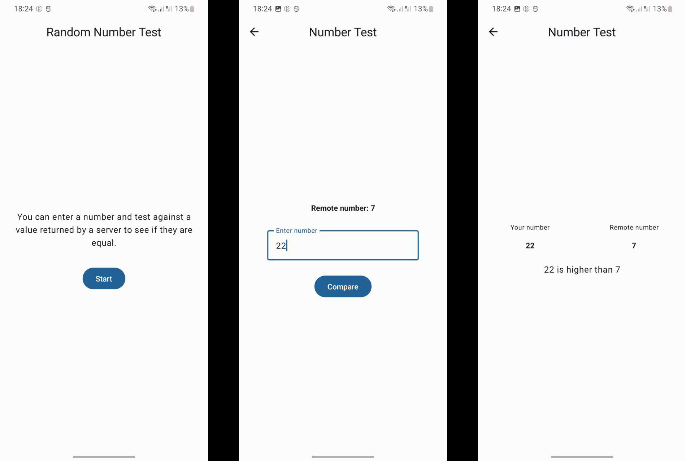

# random-number-test
Test assignment Android project

## Info:
- Time spent on this project: ~3 hours.

## Requirements for build:
- Android Studio Dolphin | 2021.3+
- Java 11
- Android SDK target 33, min 24

## Features:
- Kotlin, MVVM, Compose, Material3, Hilt, Navigation, Lifecycle, Flow, okhttp/retrofit, unit tests.

## Todo/Improve:
- Cover with UI tests but it's way longer than 3 hours limit I had. 
- Some UI/UX improvements for better feeling.

